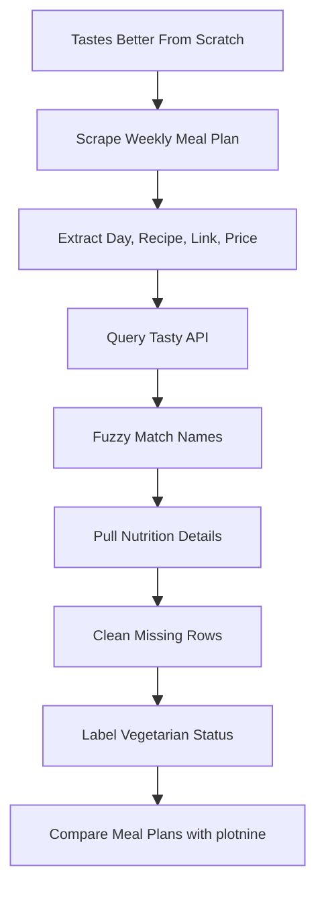
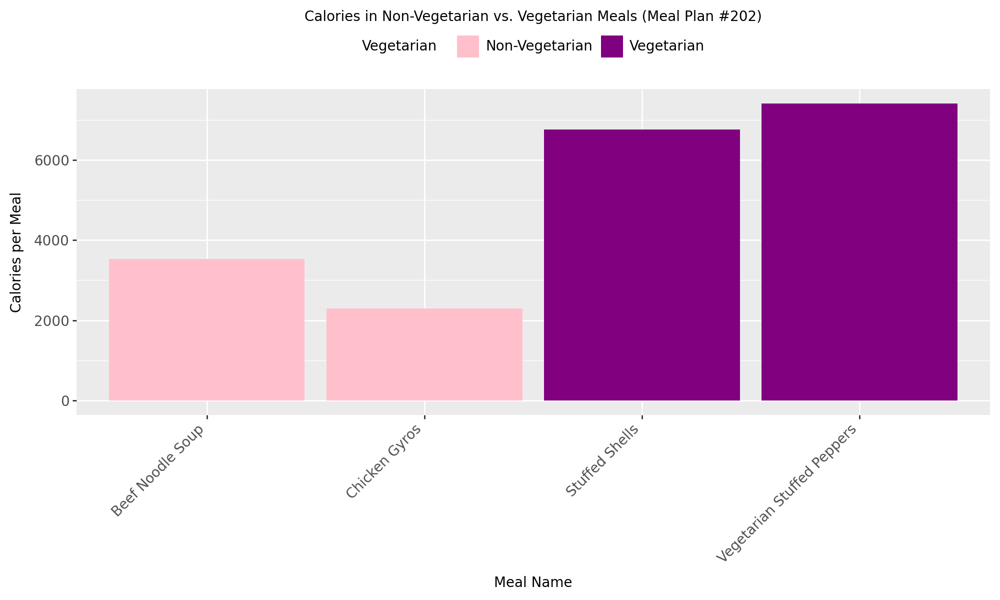
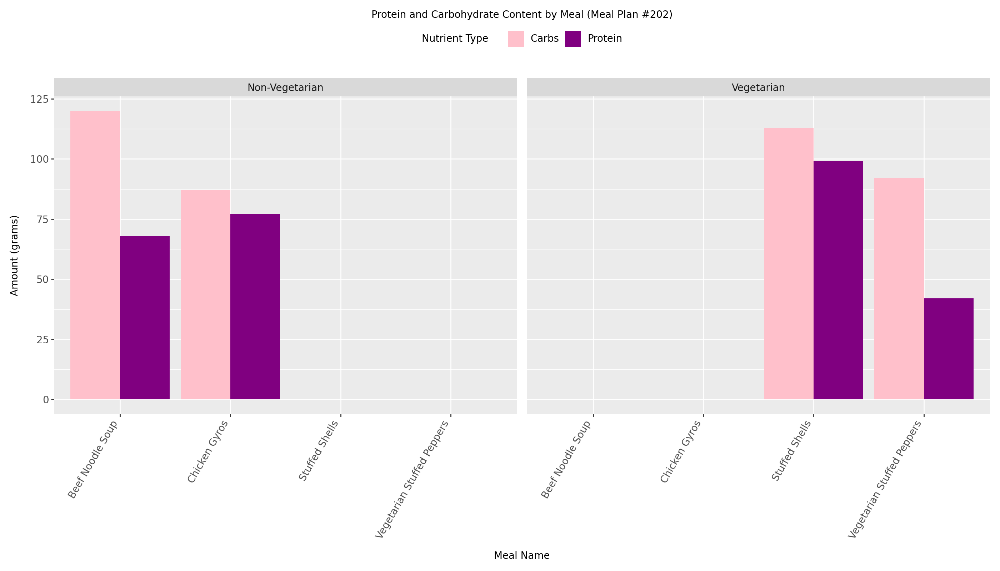

# Nutrition Web Scraping Pipeline


---

## Overview

This project builds a web-scraping and API-enrichment pipeline that compares weekly meal plans from a recipe blog by joining them against the Tasty API for nutrition data.

The workflow includes:
- Scraping meal-plan recipes from Tastes Better From Scratch
- Fuzzy matching of scraped recipe names against Tasty API search results
- Nutrition-data enrichment (calories, protein, carbohydrates, fat)
- Vegetarian / non-vegetarian labeling from recipe text
- Side-by-side meal-plan comparison with tables and `plotnine` charts

The project demonstrates how a practical data pipeline can stitch together unstructured web content and a structured API into a single analytical view.

---

## Project Workflow



---

# Business Problem

Comparing meal plans head-to-head requires nutrition data that is not directly available on the source blog. The Tasty API has the nutrition details but its recipe naming does not match a third-party blog's listing exactly. A small pipeline that bridges the two unlocks calorie- and macro-level comparison without manual entry.

Accurate scraping-and-enrichment pipelines can support:
- Recipe-aggregator product backends
- Dietary planning and tracking tools
- Nutritional comparison across cuisines or sources
- Reproducible recipe-data ETL for downstream analytics
- Teaching examples for fuzzy-matching and API joins

This project compares calorie, protein, and carbohydrate profiles across two scraped meal plans.

---

# Dataset

The pipeline produces a structured nutrition dataset from two external sources:

- Tastes Better From Scratch weekly meal-plan pages (HTML)
- Tasty API recipe search and detail endpoints (JSON)

Per-meal fields collected:
- Day of the week
- Recipe name and link
- Listed price (when available)
- Cook time
- Ingredient count
- Meal type
- Calories
- Protein
- Carbohydrates
- Fat
- Vegetarian flag (derived from recipe text)

### Output of Interest
- Average calorie / protein / carbohydrate profile per meal plan
- Per-meal nutrition breakdown for chart comparisons

This is a data-engineering and exploratory-analysis project, not a modeling project.

---

# Exploratory Data Analysis (EDA)

### Key Insights
- Meal Plan `111` averages 472.0 calories, 31.1 g protein, 37.7 g carbs per meal
- Meal Plan `202` averages 559.6 calories, 29.4 g protein, 52.4 g carbs per meal
- Meal Plan `202`'s higher calorie total is driven by two carb-heavy vegetarian entries (Stuffed Shells, Vegetarian Stuffed Peppers), not by its meat dishes
- Carbohydrates lead protein in every meal, but the gap is uneven — Beef Noodle Soup and Vegetarian Stuffed Peppers are the carb-heavy outliers

### Meal Plan Comparison

| Meal Plan | Average Calories | Average Protein | Average Carbs |
| --- | ---: | ---: | ---: |
| 111 | 472.0 | 31.1 | 37.7 |
| 202 | 559.6 | 29.4 | 52.4 |

---

# Data Preprocessing

The preprocessing workflow includes:

- Parsing HTML with BeautifulSoup
- Extracting recipe metadata into a tidy DataFrame
- Calling the Tasty API per recipe with `requests`
- Fuzzy matching of scraped recipe names against API search results
- Removing rows with missing nutrition values
- Labeling meals as vegetarian or non-vegetarian by recipe text

### Pipeline Components
- `requests` for HTTP calls
- `BeautifulSoup` for HTML parsing
- `rapidfuzz` for name matching
- `pandas` for tabular cleaning
- `re` for text normalization

The preprocessing layer turns two heterogeneous sources into one clean per-meal table ready for visualization.

---

# Pipeline Architecture


### Core Functions

| Function | Purpose |
| --- | --- |
| `get_weekly_plan(plan_number)` | Scrapes a weekly meal plan and returns meal names, links, days, and prices. |
| `match_recipe(df_week)` | Searches the Tasty API and appends nutrition and cooking details. |
| `get_mealplan_data(meal_num)` | Combines scraping and API matching into one reusable workflow. |

### Pipeline Configuration
- Source site: Tastes Better From Scratch
- API: Tasty (RapidAPI)
- Match algorithm: `rapidfuzz` ratio with score threshold
- Visualization: `plotnine` grammar of graphics

---

# Pipeline Outputs

### Visualization Metrics
- Calorie distribution by vegetarian status
- Macro-nutrient (protein + carbs) breakdown per meal
- Cross-plan average comparison table

### Calories by Vegetarian Status

For Meal Plan `202`, the vegetarian meals — Stuffed Shells (~6,700 cal) and Vegetarian Stuffed Peppers (~7,300 cal) — sit well above the non-vegetarian options Beef Noodle Soup (~3,500 cal) and Chicken Gyros (~2,300 cal). The chart makes it visually clear that the higher per-plan calorie average for `202` is driven by the two pasta-and-grain-heavy vegetarian dishes rather than by the meat-based meals.



### Protein and Carbohydrates by Meal

Splitting protein (purple) and carbs (pink) per meal, faceted by vegetarian status, exposes a clear macro-nutrient pattern. Carbs lead protein in every meal, but the gap is uneven: Beef Noodle Soup and Vegetarian Stuffed Peppers are the carb-heavy outliers (each roughly twice as much carb as protein), while Chicken Gyros and Stuffed Shells stay much closer to balanced.



### Key Findings
- The pipeline successfully bridges an unstructured blog source and a structured API into one comparable table
- Fuzzy matching is necessary — exact-name joins miss most recipes because the blog and API name them differently
- Plot-driven comparison surfaces patterns that single averages hide (e.g. carb-heavy outliers)
- Meal Plan `111` is the lighter, more protein-leaning plan; Meal Plan `202` is heavier and carb-driven

---

# Insight Interpretation

The pipeline demonstrates how a small but reusable scraping-plus-API workflow can produce comparable, analyzable nutrition data without manual entry.

Potential applications include:
- Recipe-aggregator product prototypes
- Dietary planning and macro-tracking tools
- Cross-source nutrition comparison studies
- Teaching examples for ETL pipelines that bridge HTML and JSON
- Foundation for a longer-running scheduled scraping job

---

# Technologies Used

- Python
- pandas
- NumPy
- requests
- BeautifulSoup
- rapidfuzz
- plotnine
- Tastes Better From Scratch (web source)
- Tasty API via RapidAPI
- Jupyter Notebook

---

# Repository Structure

```text
nutrition-web-scraping-pipeline/
│
├── Webscraping_Meals.ipynb
├── Basic_Webscraping.ipynb
├── Basic_Webscraping.html
├── images/
│   ├── calories-veg-vs-nonveg.png
│   └── protein-carbs-by-meal.png
└── README.md
```

---

# How to Run

1. Clone the repository
2. Install required dependencies
3. Configure access to the Tasty API through RapidAPI (store the key outside the notebook)
4. Open `Webscraping_Meals.ipynb` in Jupyter Notebook or Google Colab
5. Run all notebook cells sequentially

```bash
pip install pandas numpy requests beautifulsoup4 rapidfuzz plotnine
```

API and scraping notes: results depend on live websites and API responses. If the Tastes Better From Scratch page structure changes, the scraper may need selector updates. If a real key was used during development, rotate it before publishing the repository.

---

# Future Improvements

- Move the API key into environment-variable loading
- Export final comparison tables to CSV
- Add error handling for empty API responses and changed page structures
- Convert the notebook workflow into a reusable Python script
- Schedule the pipeline on a cron or workflow-orchestration tool

---

# Author

**Pranika Chandra**  
Projects focused on web scraping, data engineering, nutrition analytics, and applied data science.


